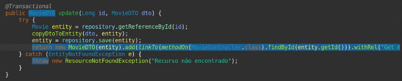

<p align="center">
  
</p>

# Objetivo

Apresentar uma visão geral sobre o HATEOAS, incluindo um estudo de caso implemenando o HATEOAS no projeto DSMovie*

## Visão Geral HATEOAS

### Introdução

- HATEOAS é um acrônimo para *Hypermedia as the Engine of Application State*, traduzido para Hipertexto como motor de estado da aplicação.


- É um importante princípio/constraint do REST que implica que uma API deve ter uma espécie de guia para mostrar aos clientes e usuários, como percorrer pelos recursos que compõem esta API.


- **Analogia:** Ao navegar em uma página web, podemos acessar diferentes páginas por meio de hyperlinks. Desta forma, podemos a partir de um link inicial, acessar diferentes links relacionados. ([Exemplo site](https://www.companhiadasletras.com.br/))

Ou seja, a partir de um ponto inicial (tela home), podemos acessar outros links relacionados.

- Desta forma, usamos o HATEOAS com o intuito de saber qual o próximo passo após a requisição em um determinado recurso e qual a URI deste recurso.

### Exemplo

- Requisição do tipo GET ao recurso accounts para solicitar os dados da conta de id 12345

```http
GET /accounts/12345 HTTP/1.1
Host: bank.example.com
```

- Resposta contendo os dados da conta id 12345

```http
HTTP/1.1 200 OK

{
    "account": {
        "account_number": 12345,
        "balance": {
            "currency": "usd",
            "value": 100.00
        },
        "links": {
            "deposits": "/accounts/12345/deposits",
            "withdrawals": "/accounts/12345/withdrawals",
            "transfers": "/accounts/12345/transfers",
            "close-requests": "/accounts/12345/close-requests"
        }
    }
}
```
Veja que ele mostra os links para deposito, saques, transferências...

Logo, a partir de um recurso, acessamos outros.

* Retirado de https://en.wikipedia.org/wiki/HATEOAS

### Postman

Veja a requisição get em /movies abaixo.

Ela retorna uma lista de links.

O primeiro resultado com "self", fazendo referência a própria URI.

O segundo resultado fazendo referência ao findById.


Caso cliquemos no findById, navegaremos para outro link, e o resultado:

O filme com a ID de um e todos os links com as propriedades pertinentes a ele: self, get, put, delete.


E é um ciclo. Se clicarmos no delete, podemos deletar um filme, um put... e por aí vai.

### Características e discussões sobre o HATEOAS

- Uma API só pode ser considerada RESTfull, caso a mesma implemente HATEOAS. Isso é o que define Roy Fielding, dentre outros pesquisadores.

- O HATEOAS confere a uma API o nível máximo de maturidade ([Glória do REST](https://martinfowler.com/articles/richardsonMaturityModel.html))

- Na prática, o mercado ainda está em um nível de maturidade um pouco menor. A maioria das APIs que nós vamos encontrar, não utilizam HATEOAS. E está tudo certo!

- Quando utilizar e quando não utilizar HATEOAS, depende...
    - Necessário avaliar a relação custo/benefício para cada projeto
    
- Para implementar o HATEOAS nas nossas APIs vamos usar o Spring HATEOAS (https://spring.io/projects/spring-hateoas)

## Estudo de caso: Implementando HATEOAS no projeto DSMovie

#### Pré-requisito

[Baixar projeto DSMovie Ref](https://github.com/devsuperior/dsmovie-ref)

### Passo: Dependência Maven

- Incluir a dependência do HATEOAS no arquivo pom.xml:

```xml
<dependency>
    <groupId>org.springframework.boot</groupId>
	<artifactId>spring-boot-starter-hateoas</artifactId>
</dependency>
```

### Passo: Import estáticos

```java
import static org.springframework.hateoas.server.mvc.WebMvcLinkBuilder.linkTo;
import static org.springframework.hateoas.server.mvc.WebMvcLinkBuilder.methodOn;
```

### Passo: Onde implementar Hateoas?

Pode ser implementado no Controller, mas faremos na camada de Service.

Lá estão TODAS as regras de negócio, então deixamos algo mais padronizado. Mas saiba, pode sim ser implementado no
Controller/Resource.

## Service

Coloque os imports estáticos no Service, começaremos pelo findAll.

### findAll

Teremos que incluir o link que queremos retornar para este método. Retornaremos um link auto referenciável (self) e outro
de referência para consultar por ID.


Iremos mexer na classe MovieDTO.

Daremos um extends "RepresensationModel<MovieDTO>".

A partir disso, iremos voltar no service e depois do lambda, daremos um ".add" será um link. O link no caso dos recursos.

Usaremos dentro do add um "linkTo". Nele, colocaremos um "methodOn". O primeiro parâmetro é um recurso (controller),
passando o método, o segundo argumento do methodOn pode apagar.

Como estamos chamando o findAll do controller dentro do findAll do service, acaba sendo um auto relacionamento. Por isso,
daremos um ".withSelfRel()".

Para colocar o outro link (por ID), colocaremos outro ".add" com outro "linkTo" com MovieController de novo, mas agora
com o findById. Qual id passar? A gente usa o "x" do próprio lambda com ".getId()". Por fim, daremos o relacionamento.

Desta vez, não é um auto relacionamento, então daremos ".withRel("Get movie by id) < com uma descrição".


### Hateoas findById, Insert e Update

### findById


Como no findById teremos link modificaremos algumas coisas.

Ao invés de retornar um new Movie DTO direto, criaremos manualmente com ``MovieDTO dto = new MovieDTO(result)``.

É bom fazer isso, pois teremos vários links, então facilita o nosso trabalho.

Faremos a mesma coisa! Depois de instanciar, um ponto com os add's, veja:

Primeiro linkTo com auto referência, o segundo pro findAll(null), update e delete passando o próprio ID de parâmetro
do método.


### Insert

Podemos colocar os add's no próprio return, veja:

Usamos o findById, pois após dar um update em um Movie específico, a ideia é que a gente vá querer consultá-lo.


### Update

Add's no return mesmo.



### Delete 

Não precisa, pois o mesmo retorna void.
